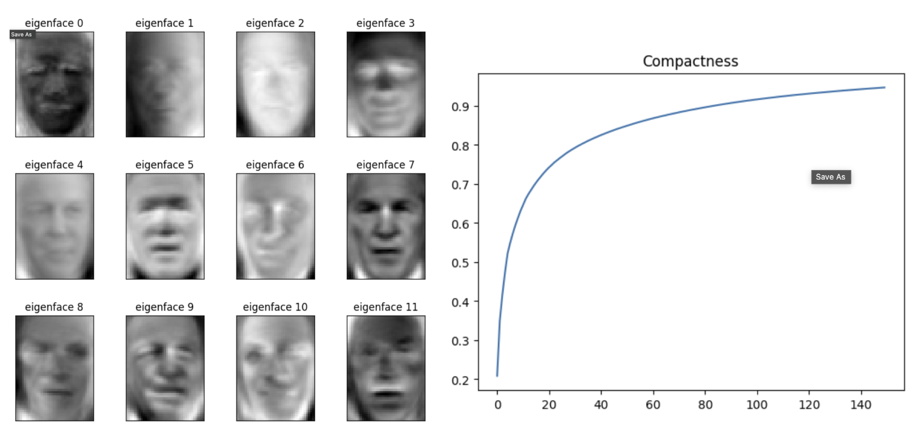
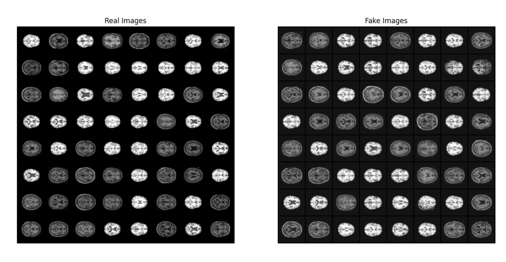

# Deep Learning Experimentation 

This repository contains the implementation and exploration of three major deep learning tools. Each part focuses on different machine learning and deep learning techniques, applied to well-known datasets.

## Table of Contents
- [Part 1: PCA and CNN on LFW Dataset](#part-1-pca-and-cnn-on-lfw-dataset)
- [Part 2: ResNet for DawnBench Challenge](#part-2-resnet-for-dawnbench-challenge)
- [Part 3: DCGAN on OASIS Dataset](#part-3-dcgan-on-oasis-dataset)

## Part 1: PCA and CNN on LFW Dataset

In this section:
- Explore Principal Component Analysis (PCA) and Convolutional Neural Networks (CNNs) for face recognition using the LFW (Labeled Faces in the Wild) dataset.
- Compare the performance of CNNs against Random Forest models and PCA, focusing on accuracy and computational efficiency.

Using PCA, I created compactness graphs and eigenvalue representation of LFW faces.

This method produced 60% accuracy during testing compared to the CNN, which achieved ~86% after 12 epochs of training.

## Part 2: ResNet for DawnBench Challenge

In Part 2, I created a ResNet (18) architecture to compete in the DawnBench challenge. As per the ResNet paper, I implemented the architecture from scratch using PyTorch.

In this model implementation, I included: 
- Data normalization and augmentation to improve the diversity of training data.
- Batch normalization to improve the performance of the model.
- Skip connection layers to improve the performance and reduce the possibility of the vanishing gradient problem.
- Learning rate scheduler to increase the learning rate during training in order to achieve super convergence.

Using these strategies, I was able to achieve 93.82% accuracy over 35 epochs while training the model on a GPU cluster of A100s.

The SLURM files used to operate the cluster requests are not included as a part of this repository.

## Part 3: DCGAN on OASIS Dataset

In Part 3, I implemented the Deep Convolutional Generative Adversarial Network (DCGAN) on the OASIS brain MRI dataset. The goal of this section was to use the dataset to generate realistic brain MRI scans.

This involved training a Generator to learn the probability distribution of the brain MRI dataset by converting Gaussian noise to realistic brain images. Simultaneously, I trained a Discriminator to discern between generated brain images and real images.

The training loss for the Generator and Discriminator can be found below.

Additionally, the final Generator images can be found here after training.

